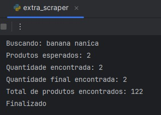
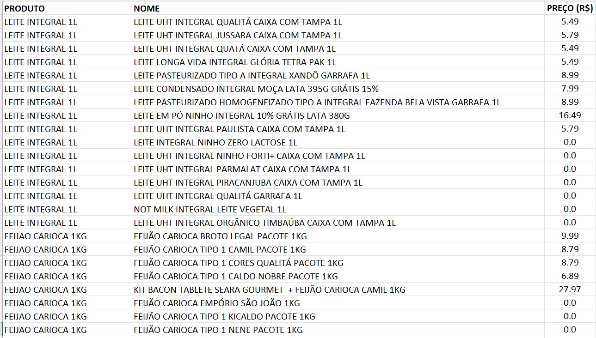

# Web Scraping - Extra Mercado

Projeto de web scraping desenvolvido em Python utilizando Selenium.

O script realiza buscas automáticas de produtos de cesta básica no site do Extra Mercado e exporta os resultados para um arquivo CSV.

## Tecnologias utilizadas

- Python
- Selenium
- Regex
- CSV

## Funcionalidades

- Busca automatizada de produtos
- Scroll dinâmico da página
- Tratamento de carregamento assíncrono
- Exportação dos dados para CSV

## Como executar

Clone o repositório:

```bash
git clone https://github.com/chqueiroz/web-scraping-extra.git
```

Instale as dependências:

```bash
pip install -r requirements.txt
```

Execute o script:

```bash
python extra_scraper.py
```

## Exemplo de execução

### Terminal



### Resultado CSV

